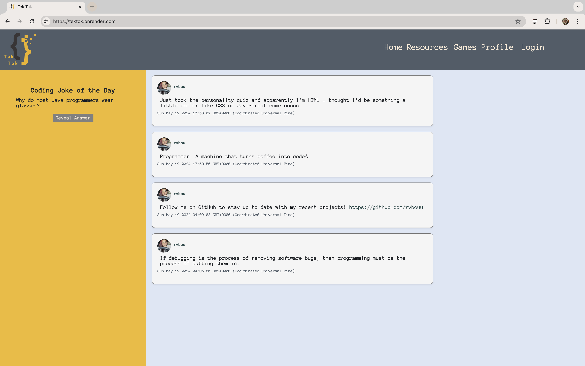
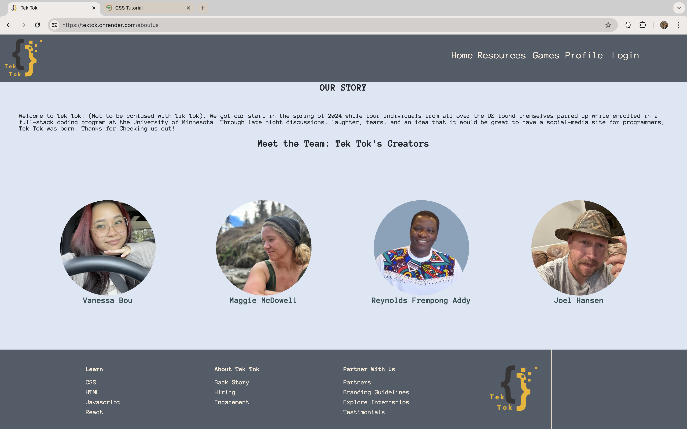
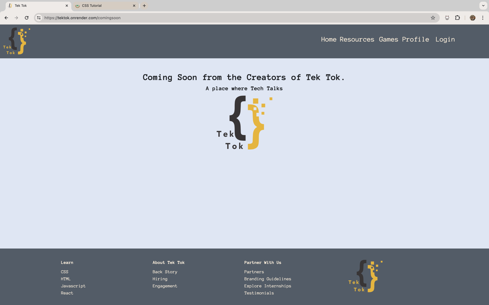
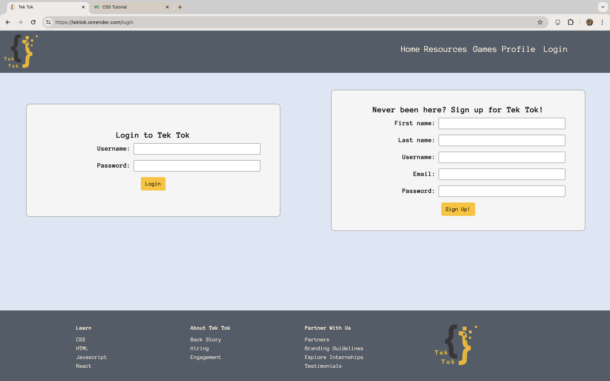
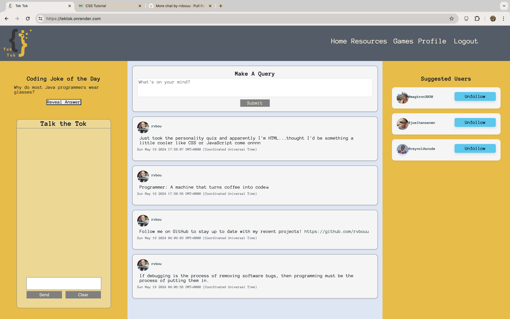
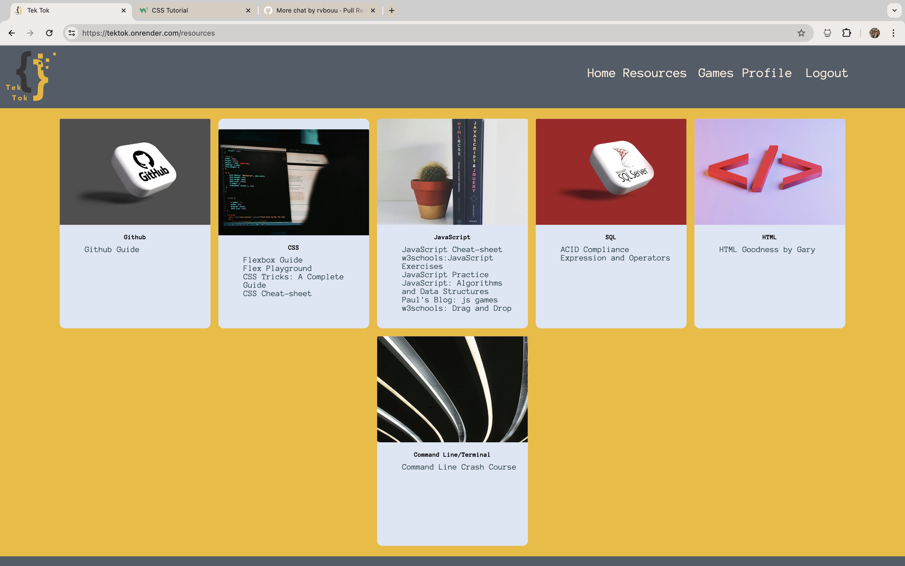
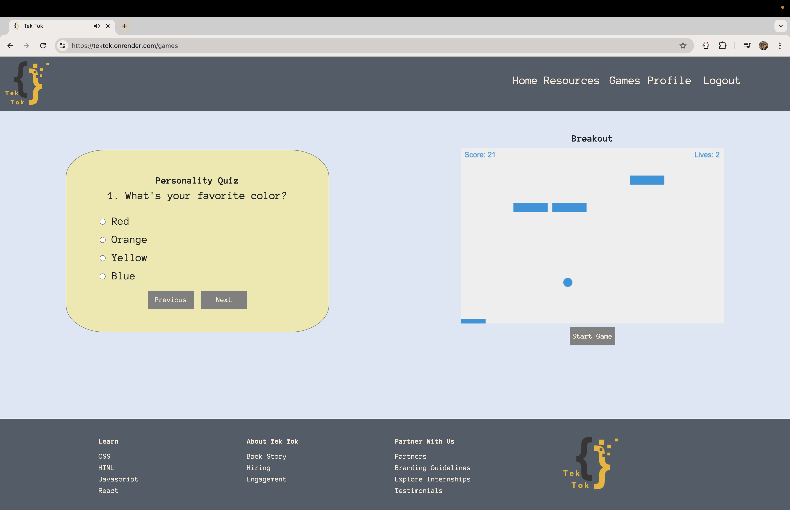
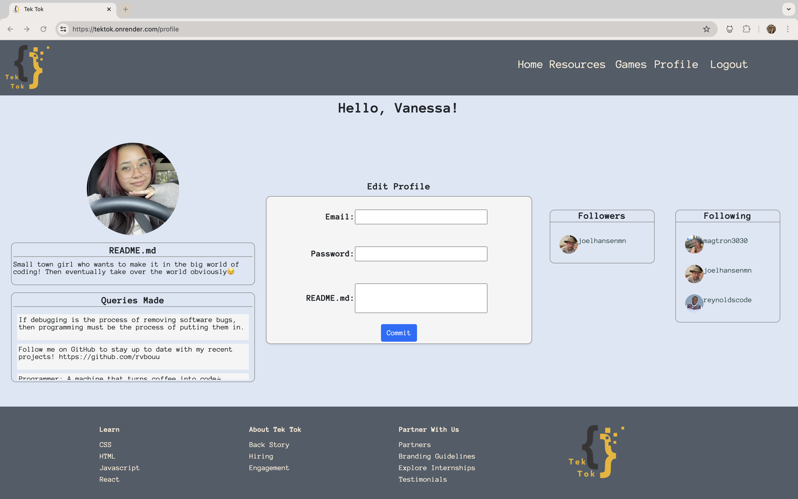
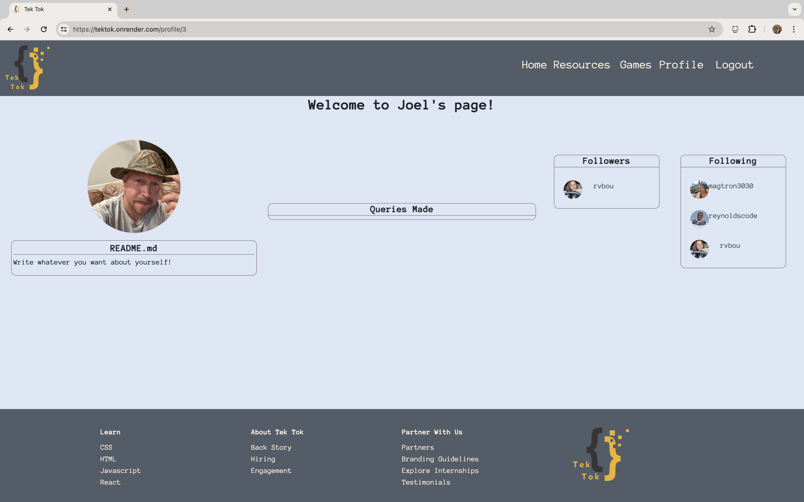

# TekTok

## Description

Welcome to Tek Tok! (Not to be confused with Tik Tok). We got our start in the Spring of 2024 when four individuals from all over the US found themselves paired up while enrolled in a full-stack coding program at the University of Minnesota. Through late night discussions, laughter, tears, and an idea that it would be great to have a social-media site for programmers; Tek Tok was born. Thanks for checking us out! 

[Here](https://github.com/users/rvbouu/projects/1) is the link to our project board. It is also linked below in our [Badges and Acknowledgements](#badges-and-acknowledgements) section.

## Table of Contents

* [Description](#description)

* [Authors](#authors)

* [Badges and Acknowledgements](#badges-and-acknowledgements)

* [Installation](#installation)

* [Usage and Screenshots](#usage-and-screenshots)

* [Functionality](#functionality)

* [Deployed Application](#deployed-application)

## Authors

[Reynolds Addy](https://github.com/Reynoldscode)

[Vanessa Bou](https://github.com/rvbouu)

[Joel Hansen](https://github.com/JoelhansenMN)

[Maggie McDowell](https://github.com/magtron3030)

## Badges and Acknowledgements

**Thank you** to our instructor Gary and TAs, Katy and Austin, for assisting us with our many GitHub and code issues.

**Thank you** to all team members for all their hard work and efforts.

### *Inspired By*

[Personality Quiz: Paige Starkey](https://codepen.io/paigeellenstark/pen/MVGYWO)

[Breakout Game: MDN Web Docs](https://developer.mozilla.org/en-US/docs/Games/Tutorials/2D_Breakout_game_pure_JavaScript)

## Installation

💾

`npm init`

`npm i animate.css animejs bcrypt connect-session-sequelize
dotenv express express-handlebars express session linkify-html linkifyjs pg sequelize socket.io`

## Usage and Screenshots

***Before beginning on local machine***

- To seed data and create the PostgreSQL tables, type `npm run seed` into command-line
- After seeding data, type `node server.js` or `nodemon server.js` to run the application.

When users first come to the site, they will get to see posts made by other users as well as the 'Coding Joke of the Day'.

Users without accounts will also have access to the links that are in the footer. Because we are a small group with no funding yet, some of our pages will say 'Coming Soon from the Creators of Tek Tok'.

If users try to navigate to a page that requires them to be logged in, they will be redirected to the signup/login page where they can create an account.

Once a user creates an account or signs up for one, they are able to access the other pages linked in the header.

On the homepage, users will now have access to the chat feature and the ability to make their own 'queries' or posts and follow other users. 

On the Resources page, users will have access to links that have been shared throughout the cohort. These links are sorted by programming language.

The Games page is for when users want to take a break from coding or just need to clear their head. They can play our fully functional Breakout game, or take a quick personality quiz to find out what programming language they are while listening to some music!

On the user's profile page, they are able to see who their followers/following are, what queries they've made, as well as update their email, password, or README.md (about me section).

When the user clicks on someone else's tag, their able to view the other user's profile. This includes their README.md, any queries they've made, as well as their followers/following.

After hanging around Tek Tok and writing a few posts, and also to make sure no one else makes any posts under their account, the user can call it a day by clicking the logout button. This will revert the website to how it was before logging in.

## Functionality

## Deployed Application

[Link to deployed application on Render](https://tektok.onrender.com/)
